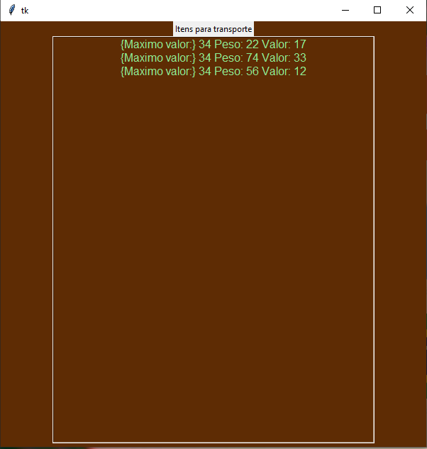

Tema:
 - Greed

# Mercador Medieval

**Número da Lista**: 44<br>
**Conteúdo da Disciplina**: Projeto de algoritmos<br>

## Alunos
|Matrícula | Aluno |
| -- | -- |
| 19/0042303  |  Carlos Daniel de Godoy Barros Nascimento |
| 18/0121847  |  Helder Lourenço de Abreu Marques |

## Sobre  
Um projeto simples que tenta encontrar o valor maximo de objetos que cabem em uma mochila, dados seu peso/valor tenta encontrar o melhor encaixe.

## Screenshots

<p>Imagem da tela inicial:<p>
<div>
  
</div>

<p>Imagem da tela de inserção de dados da mochila e dos itens:<p>
<div>
  
</div>

<p>Imagem da tela de resultado do encaixe:<p>
<div>
  
</div>

## Instalação 
**Linguagem**: Python<br>

Para executar o projeto é necessario instalar a biblioteca "tkinter" com o seguinte comando

```bash 
pip install tk
```
caso haja problemas siga o seguinte tutorial:

<a href="https://www.tutorialspoint.com/how-to-install-tkinter-in-python" target=_blank>Installing Tkinter</a></h3>
## Uso 
Apos a instalação das bibliotecas executar o seguinte comando na raiz do projeto:

```bash 
python3 main.py
```

## Vídeo de apresentação do projeto
[Video no youtube](https://youtu.be/oIaHr3kIQkk)

Tambem está disponivel na raiz deste projeto na pasta com nome "Video"